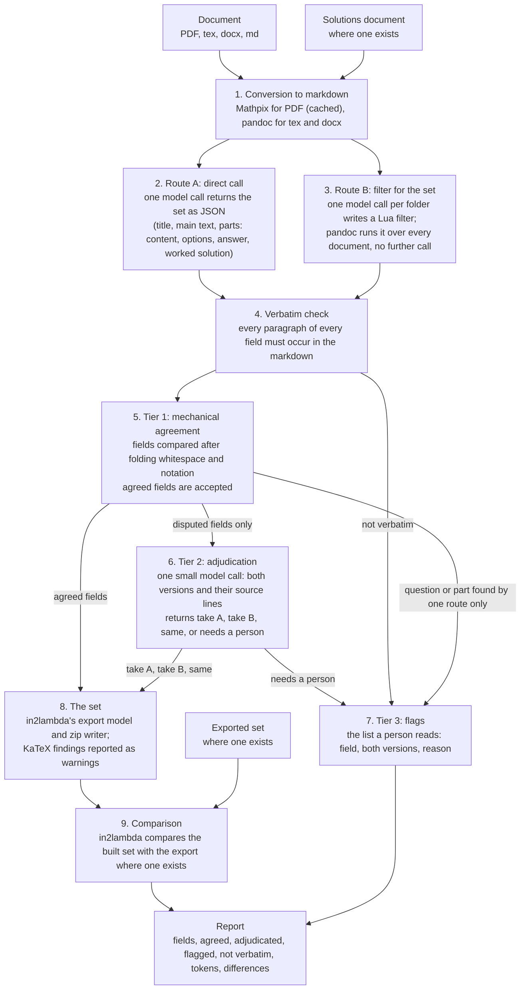

# Plan: two routes from a document to a set

Date: 2026-09-21. This plan replaces the spec engine, the draft commands and the fixing
loop on the agent's path. That code stays in the in2lambda package and is not used by the
agent.

## Goal

The agent converts one document (PDF, tex, docx or markdown), with its solutions document
where one exists, into a Lambda Feedback set. The set must match the set the author would
enter by hand. The measure is a comparison with exported sets: the ME2 introduction pair
first, then sets the maintainer has validated on the platform.

## The route of one document

1. **Conversion to markdown.** Mathpix converts a PDF; the result is cached by the PDF's
   hash. pandoc converts tex and docx. Both exist.
2. **Route A: the direct call.** One model call receives the markdown, and the solutions
   markdown where one exists, and returns the set as JSON in the export's shape: for each
   question, the title, the main text, and the parts, each with content, options, answer
   and worked solution. The prompt instructs the model to copy text and never to write it.
3. **Route B: a filter written for the set.** For a folder of documents with one
   structure, one model call receives an abbreviated view of pandoc's tree of the first
   document and returns a Lua filter that emits the same JSON. pandoc runs the filter over
   every document in the folder. No further model call is made.
4. **The verbatim check.** Every paragraph of every field from either route must occur in
   the markdown the route read, after whitespace is folded. A field that fails is flagged.
5. **Tier 1: mechanical agreement.** The two replies are compared field by field after
   folding whitespace and notation that renders identically: `\left(` and `(`, `~` and
   `\,` and a space, `\mathrm{~m}` and `\mathrm{m}`. A field on which the replies agree
   is accepted.
6. **Tier 2: adjudication.** One model call per document receives the disputed fields
   only: both versions and the source lines each was quoted from. For each field the
   call returns one of: same meaning, take A, take B, or needs a person, with a one-line
   reason. The call may choose one of the two texts or a passage of the source. The
   verbatim check runs on the chosen text, so the call cannot introduce its own words.
7. **Tier 3: flags.** The report lists the fields a person must read: fields the
   adjudicator returned as "needs a person", fields that failed the verbatim check, and
   questions or parts that one route found and the other did not. Each flag shows both
   versions and the reason.
8. **The set.** in2lambda's export model and zip writer write the set. KaTeX findings on
   the maths are reported as warnings. No check blocks the write.
9. **The comparison.** Where an exported set exists for the document, in2lambda's
   comparison reports the differences between the built set and the export.

## What the agent keeps and what it sets aside

Kept: the OCR and its cache; the model backends; in2lambda's export model, zip writer and
comparison; the corpus sweep and its results table, re-pointed at this route; the web page,
re-pointed at this route.

Set aside on the agent's path: the YAML spec and its layouts; the draft with its blocks,
layers and command log; the fixing loop; the coverage check, the delimiter check and the
xelatex compile as conditions for writing a set. The in2lambda package keeps this code.

## What the tiers detect

The verbatim check detects a route inventing or rewording text. The structural comparison
detects a question or part that one route missed. The adjudication resolves wording the
two routes read differently.

The tiers do not detect an error in the markdown. Both routes read the same OCR output, so
a word Mathpix misread, or a separator line Mathpix read as a minus sign, passes every
tier. The comparison with an exported set, or a reader, detects those. An OCR check is
separate work.

## Response areas

The built set has no response areas: the answer boxes and their marking are not on the
sheet, and choosing them requires judgement. A model call per part, given the part's
content, options and final answer, can propose them, and the ME2 export gives 13 to
measure against. This is deferred.

## Cost

At Sonnet-class rates, about $3 per million input tokens and $15 per million output
tokens: the direct call costs about $0.17 per sheet with solutions and $0.06 for a
questions-only sheet; a filter costs about $0.05 per folder; an adjudication call costs
under a cent. One hundred sheets in ten folders through both routes cost $7 to $18.

## Results so far

The ME2 pair, live: 5 questions, 60 fields, 0 flags, titles equal to the export's, one
model call, 66 seconds with the OCR cached. The PHYS40002 folder, route B: one filter
written from the first sheet in 41 seconds; pandoc converted all 9 sheets, 65 questions,
467 fields, 1 field flagged.

## Order of work

1. Run both routes with the solutions files over the PHYS40002 folder and report the flag
   counts.
2. Run one PDF from the UCL_MechEng folder.
3. Review the flags with the maintainer.
4. Re-point the sweep, the page and the gate at this route, as tickets the maintainer has
   reviewed (docs/tickets-draft.md).

## Measures

Per document: fields returned, fields agreed at tier 1, fields adjudicated, fields flagged,
fields not verbatim, tokens used; and the comparison table where an export exists. Per
folder: the totals of the same.
